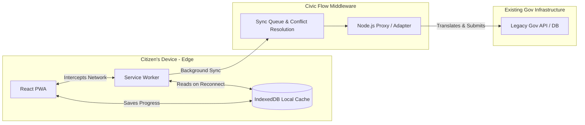

# 🏛️ CivicFlow

**The Resilient Digital Public Infrastructure Layer (A "Shock Absorber" for the Internet)**

[](LICENSE)
[](CONTRIBUTING.md)

---

## 🌟 The Vision

**Civic Flow is a reliability and integration layer for digital public services.**

Today, applying for a government service is frustrating. Citizens spend 30 minutes filling out forms and uploading documents. Then the internet disconnects, the legacy government server times out, or the session expires. **The citizen loses all their work and has to start again.**

**We are not building another government portal.** Civic Flow acts as a secure middleware that sits *between* the citizen and the existing, fragile government backend. 
- If the internet dies, the citizen can keep typing offline.
- If the government server crashes on deadline day, Civic Flow catches the data, saves it locally, and automatically submits it when the server recovers.

**Government downtime should not automatically become citizen data loss.**

---

## 🎯 Key Features & Value Proposition

### 🔒 Offline-First Edge Storage
- Zero data loss during network failures or server crashes.
- Local data persistence with IndexedDB on the citizen's device.
- Automatic background synchronization when the connection is restored.

### 🤝 The B2G "No Rip-and-Replace" Promise
- We don't ask governments to throw away their existing databases.
- Civic Flow acts as an adapter, translating modern JSON payloads into legacy API calls.
- Deploys on-premise or in private clouds to maintain strict data sovereignty.

### 🧩 Dynamic Form Schema System
- Backend-driven form generation via JSON schemas.
- No frontend redeployment required to launch new government forms.
- Reusable "Civic Profile" data to prevent citizens from typing the same info twice.

### 📊 Service Health Observability (For Orgs)
- Governments get a dashboard showing where digital experiences are breaking (e.g., "Scholarship API is currently experiencing High Latency").
- Tracks form abandonment and failed synchronization attempts.

---

## 🛠️ Tech Stack

| Layer | Technology | Purpose |
|-------|------------|---------|
| **Frontend** | ⚛️ React 19 + Vite | Hyper-fast, modern UI framework |
| **Edge Cache** | 💾 IndexedDB + Workbox | Offline storage and Service Worker background sync |
| **Styling** | 🎨 Tailwind CSS v4 | Clean, accessible, responsive design |
| **Middleware** | 🟢 Node.js + Express | The "Shock Absorber" proxy and API adapter |
| **Form Engine**| 📄 JSON Schemas | Dynamic, version-controlled form generation |

---

## 🏗️ Architecture Overview



---

## 🚀 Getting Started

### **Prerequisites**
- Node.js 18+ and npm
- Git

### **Installation**

1. **Clone the repository**
   ```bash
   git clone https://github.com/your-username/CivicFlow.git
   cd CivicFlow
   ```

2. **Install Backend Dependencies**
   ```bash
   cd backend
   npm install
   cp .env.example .env
   ```

3. **Install Frontend Dependencies**
   ```bash
   cd ../frontend
   npm install
   cp .env.example .env
   ```

### **Development**

**Start Middleware (Backend) Server:**
```bash
cd backend
npm run dev  # Runs on http://localhost:4000
```

**Start Frontend Development Server:**
```bash
cd frontend
npm run dev  # Runs on http://localhost:5173
```

---

## 🗺️ MVP Roadmap (Current Focus)

- [ ] **Phase 1: Mock Infrastructure** 
  - Build a `mock-gov-backend` that intentionally simulates 504 Timeouts, 500 Errors, and latency to prove the reliability loop.
- [ ] **Phase 2: The Core Reliability Loop**
  - Implement full offline CRUD (Create, Read, Update, Delete) via IndexedDB.
  - Implement Workbox background sync for payload submission upon reconnection.
- [ ] **Phase 3: Deferred Authentication (OTP)**
  - Build UX flows that allow users to fill forms offline, but gate final submission behind an online OTP prompt.
- [ ] **Phase 4: Observability Dashboard**
  - Build the Admin view showing failed requests recovered by Civic Flow.

---

<div align="center">
**Built with ❤️ for resilient digital public infrastructure**
</div>
