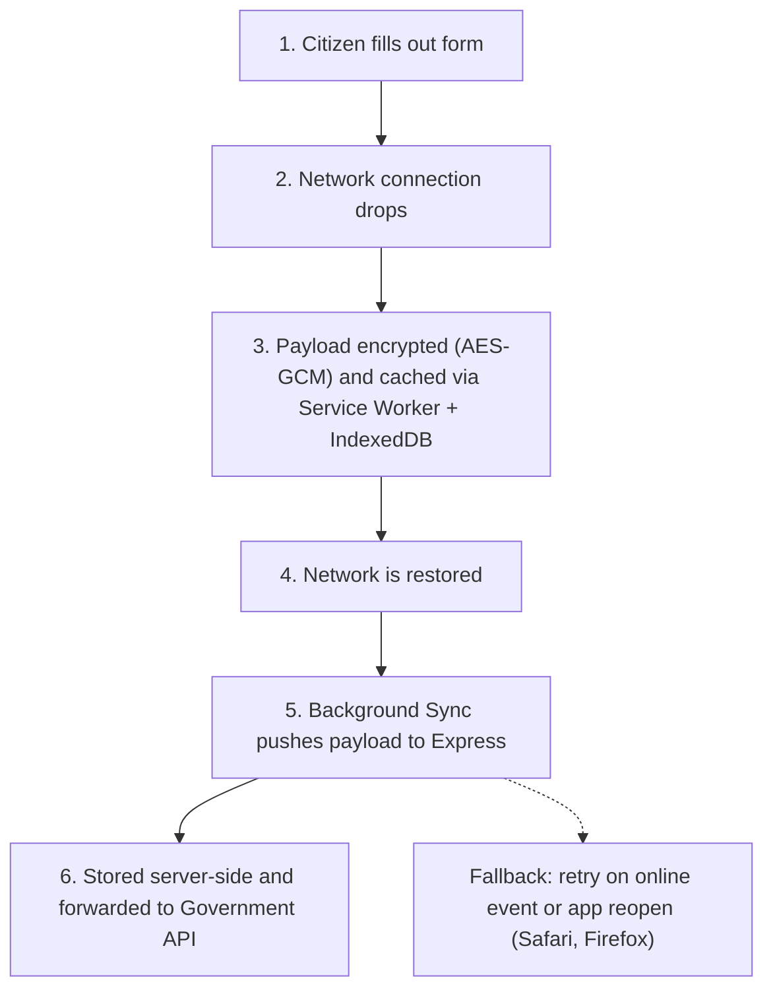
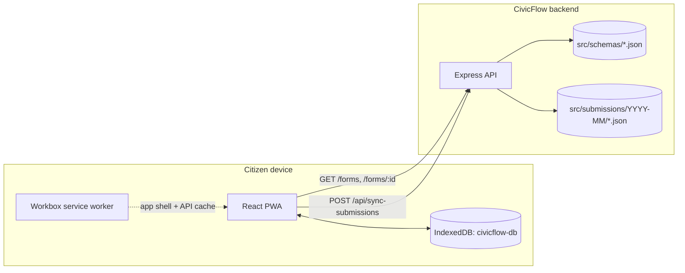

# 🏛️ CivicFlow

**Offline-first reliability layer for public service forms. A "shock absorber" between citizens and fragile government portals.**

[](LICENSE)
[](#-contributing)

> Government downtime should not become citizen data loss.

---

## 🌟 Overview

Citizens spend 30–45 minutes filling in government forms and uploading documents. One dropped connection, session timeout, or deadline-day server crash wipes everything. The citizen starts over, support centres flood, and public trust drops.

**CivicFlow is not another government portal.** It is offline-caching middleware that sits *between* the citizen and the existing government backend:

- **Cache on-device:** form progress is kept in the browser (IndexedDB), so a dropped connection loses nothing.
- **Sync on reconnect:** queued submissions are sent when the network returns, with idempotent retries so nothing is sent twice.
- **Adapt, don't replace:** an adapter forwards data to existing government APIs (REST/SOAP). The government keeps its backend.

**Positioning:** the gap isn't "offline forms". It's a citizen-facing, drop-in reliability layer that sits in front of the portals governments already run, and is being shaped into an SDK (see [SDK](#-sdk-planned)).

**Target users:** citizens on unreliable networks; municipalities, universities, and departments running high-traffic forms (scholarships, permits, registrations); and the system integrators who build and run those portals.

---

## 🎯 Key Features

Status legend: ✅ implemented in this repo · 🚧 partially implemented · 📋 planned

| Feature | Status | Notes |
|---|---|---|
| Dynamic forms from JSON schemas | ✅ | `backend/src/schemas/*.json` rendered by `frontend/src/components/ServiceForm.jsx`. New forms need no frontend redeploy. |
| Offline schema & forms-list cache | ✅ | Cached in IndexedDB; used when the backend is unreachable or the device is offline. |
| Draft autosave | ✅ | Debounced (1s) save to IndexedDB, restored on reload. |
| Local submission queue | ✅ | Submissions are saved on-device with `synced: "pending"` before any network call. |
| Batch sync with server-side idempotency | ✅ | `POST /api/sync-submissions`; an existing `submissionId` is skipped, not duplicated. |
| Installable PWA + app-shell caching | ✅ | `vite-plugin-pwa` (Workbox): precache + `NetworkFirst` API cache. |
| Automatic sync on reconnect | 🚧 | `frontend/src/services/autoSync.js` exists but is not started yet. Sync is currently manual from **My Submissions**. |
| Retry with backoff | 🚧 | Schema fetches retry with backoff. Submission retry helpers exist but are not wired in. |
| AES-GCM encryption at rest (Web Crypto) | 📋 | Payload encrypted with a non-extractable device key before it touches IndexedDB, wiped after acknowledgement. |
| Background Sync API + `online`/app-open fallback | 📋 | Background Sync on Chromium; Safari, iOS Safari, and Firefox fall back to replaying on the `online` event or app reopen. |
| Government API adapter + retry queue | 📋 | Forward to REST/SOAP gov APIs via BullMQ + Redis with dead-letter queue. |
| Deferred authentication (OTP) | 📋 | Fill offline, verify OTP online before final submission. |
| Schema versioning | 📋 | If a form changes while a draft is offline, ask only for the new fields. |
| Cryptographic timestamps | 📋 | Tamper-evident proof a form was completed before a deadline. |
| Observability dashboard | 📋 | Recovered sessions and gov API uptime. `AdminDashboard.jsx` / `InstituteDashboard.jsx` are placeholders. |

---

## 🏗️ Architecture

### Target offline-sync loop (MVP goal)



**Data custody:** the payload is encrypted with a device-held, non-extractable AES-GCM key before it is written to IndexedDB. On reconnect the queue is replayed with an idempotency key, and the local copy is deleted only after the server persists it and the government API acknowledges receipt. Encryption protects data at rest; it does not protect an unlocked, compromised device.

### What runs today



There is no government API adapter, database, or encryption in the code yet. Submissions are stored as JSON files on the backend.

---

## 🛠️ Tech Stack

### Current implementation

| Layer | Technology |
|---|---|
| Frontend | React 19, Vite 7, React Router 7, Tailwind CSS v4 |
| Offline storage | IndexedDB via `idb` |
| Service worker | `vite-plugin-pwa` (Workbox), `autoUpdate` |
| HTTP client | Axios |
| Backend | Node.js, Express 5, `cors`, `dotenv` (ES modules) |
| Storage | JSON files on disk (`backend/src/submissions/`) |

### Target MVP stack (from `civicflow-mvp.html`, not yet adopted)

| Layer | Pick | Why |
|---|---|---|
| Frontend | Next.js | Server-rendered first load for slow phones, built-in routing |
| Service worker | Serwist (`@serwist/next`) | Workbox-based, with a built-in `BackgroundSyncQueue` |
| Local store | IndexedDB via Dexie | Handles large binary data (uploads) asynchronously |
| Sync | Background Sync + queue + `online` fallback | One-way push; fallback covers Safari and Firefox |
| Encryption | Web Crypto AES-GCM | Native, authenticated, non-extractable keys |
| Backend | Express | Minimal and easy to audit for on-prem deployments |
| Database | MongoDB | Documents fit dynamic form shapes; TTL indexes for auto-deletion |
| Gov-API retry queue | BullMQ + Redis | Backoff that survives restarts, dead-letter queue |
| Validation | JSON Schema (Ajv) | One schema renders, validates in the browser, and validates on the server |

If a pilot government mandates Postgres, PostgreSQL JSONB is a valid swap and only the persistence layer changes.

---

## 📁 Project Structure

```
CivicFlow/
├── backend/
│   ├── package.json
│   └── src/
│       ├── server.js          # Starts the HTTP server, graceful shutdown
│       ├── app.js             # Express app, routes, CORS, error handling, keep-alive
│       ├── schemas/           # JSON form schemas (one file per form)
│       └── submissions/       # Synced submissions, written as YYYY-MM/<id>.json
├── frontend/
│   ├── package.json
│   ├── vite.config.js         # Vite + Tailwind + PWA (Workbox) config
│   ├── netlify.toml           # Netlify build, SPA redirect, security headers
│   ├── .env.example
│   └── src/
│       ├── App.jsx            # Routes
│       ├── db/db.js           # IndexedDB: schemas, forms, submissions stores
│       ├── components/        # ServiceForm (schema-driven), SampleForm
│       ├── pages/             # HomePage, ServiceForms, UserSubmissions, dashboards (placeholders)
│       ├── services/          # Schema/forms fetch + cache, submissions, sync, autoSync
│       ├── hooks/             # useNetworkStatus
│       └── utils/userId.js    # Anonymous per-device UUID
├── docs/                      # Problem statement, strategy plan, pitch & FAQ
├── civicflow-mvp.html         # MVP pitch / spec page
└── LICENSE                    # Apache License 2.0
```

---

## 🚀 Getting Started

### Prerequisites

- Node.js 18+ and npm
- Git

### 1. Clone

```bash
git clone https://github.com/ateekshsoni/CivicFlow.git
cd CivicFlow
```

### 2. Backend

```bash
cd backend
npm install
echo "PORT=4000" > .env   # server defaults to 5000; the frontend expects 4000
npm run dev               # nodemon via npx → http://localhost:4000
```

Run backend commands from inside `backend/`: schemas and submissions are resolved relative to the working directory (`src/schemas`, `src/submissions`). Use `npm start` to run without nodemon.

| Variable | Default | Purpose |
|---|---|---|
| `PORT` | `5000` | HTTP port |
| `FRONTEND_URL` | `http://localhost:5173` | Allowed CORS origin |
| `NODE_ENV` | `development` | Enables request logging and error details outside production |
| `RENDER` / `RENDER_SERVICE_NAME` | unset | When set, enables a 14-minute self-ping to `/ping` |
| `RENDER_EXTERNAL_URL` / `SERVICE_URL` | unset | URL used by the keep-alive ping |

### 3. Frontend

```bash
cd frontend
npm install
cp .env.example .env      # VITE_API_URL=http://localhost:4000
npm run dev               # http://localhost:5173
```

Other scripts: `npm run build`, `npm run preview`, `npm run lint`.

| Variable | Default | Purpose |
|---|---|---|
| `VITE_API_URL` | `http://localhost:4000` | Backend base URL. Required by the status check and sync calls, which have no fallback. |

Frontend routes: `/`, `/service-forms`, `/forms/:formId`, `/user-submissions`, `/sample-form`.

### Try the offline loop

1. While online, open `/service-forms` and then a form, so the list and that schema are cached.
2. In DevTools, set the network to **Offline**. Keep typing; the draft autosaves.
3. Submit. The submission is queued in IndexedDB as `pending`.
4. Go back online, open **My Submissions** (`/user-submissions`), and press **Sync to Backend**.
5. Check `backend/src/submissions/YYYY-MM/` for the saved JSON file.

---

## 🔌 API Endpoints

All routes are defined in `backend/src/app.js`. There is no authentication yet.

| Method | Path | Description |
|---|---|---|
| `GET` | `/` | API info and endpoint list |
| `GET` | `/health` | Health, uptime, Node version, memory usage |
| `GET` | `/status` | Lightweight connectivity check used by the frontend |
| `GET` | `/ping` | Keep-alive (`{ pong: true }`) |
| `GET` | `/forms` | List forms: `{ success, count, forms: [{ id, title, description, fieldCount }] }` |
| `GET` | `/forms/:id` | Full schema for one form (`id` limited to `[a-zA-Z0-9-_]`) |
| `POST` | `/api/sync-submissions` | Batch upload queued submissions |

**`POST /api/sync-submissions`**

```json
{
  "submissions": [
    {
      "submissionId": "scholarship-2026-1703155200000-a7b3c2",
      "userId": "<device uuid>",
      "formId": "scholarship-2026",
      "formData": { "fullName": "…", "email": "…", "income": 0 },
      "status": "complete",
      "synced": "pending",
      "submittedAt": "2025-12-22T10:30:00Z"
    }
  ]
}
```

Response: `{ success, message, syncedCount, failedCount, syncedIds, timestamp, failedSyncs? }`. A submission whose file already exists is reported as synced (idempotent).

---

## 🧩 Form Schema Format

Each form is one JSON file in `backend/src/schemas/`. The file name must match the `id` (`GET /forms/:id` loads `<id>.json`).

```json
{
  "id": "scholarship-2026",
  "title": "National Scholarship Application",
  "description": "Apply for financial assistance for students",
  "fields": [
    { "key": "fullName", "label": "Full Name", "type": "text", "required": true },
    { "key": "email", "label": "Email Address", "type": "email", "required": true },
    { "key": "income", "label": "Annual Family Income", "type": "number", "required": true }
  ]
}
```

| Property | Required | Notes |
|---|---|---|
| `id`, `title`, `fields` | yes | `GET /forms/:id` rejects schemas missing any of these |
| `description` | no | Shown in the forms list |
| `fields[].key` | yes | Property name in `formData` |
| `fields[].label` | yes | Visible label |
| `fields[].type` | no | HTML input type; defaults to `text`. Used today: `text`, `email`, `tel`, `number` |
| `fields[].required` | no | Native browser `required` validation |
| `fields[].placeholder` | no | Input placeholder |

Included forms: `complaint-form`, `contact-us`, `event-registration`, `feedback-form`, `permit-application`, `scholarship-2026`, `service-request`.

The target is standard JSON Schema validated with Ajv on both client and server, plus a schema `version` field (planned).

---

## 🔄 Offline Sync Flow (current)

1. **Load:** `GET /forms` and `GET /forms/:id` responses are cached in IndexedDB (`civicflow-db` → `forms`, `schemas`). Offline or on failure, the cached copy is used.
2. **Draft:** every change is autosaved after 1s to `forms` under `draft_<formId>` and restored on reload.
3. **Queue:** submit writes to `submissions` with `status: "complete"`, `synced: "pending"`, an anonymous device `userId`, and `submissionId = <formId>-<timestamp>-<random>`. The draft is cleared.
4. **Sync:** **My Submissions → Sync to Backend** sends all pending submissions for this device in one batch.
5. **Persist:** the backend writes `src/submissions/YYYY-MM/<submissionId>.json`, skipping IDs that already exist.
6. **Reconcile:** the client marks returned `syncedIds` as `synced`; any `failedSyncs` are marked `failed` with a retry count.

---

## ✅ MVP Success Criteria

These are targets, not measured results.

**Technical**
- 0 bytes of form data lost in the airplane-mode demo.
- Queued payload syncs within 5s of reconnect on Chromium, and on next app open in Safari and Firefox.
- 100% eventual delivery against a mock gov server with a 30% failure rate and 10s latency.
- 0 duplicate submissions after retries (server-checked idempotency keys).
- Payload AES-GCM encrypted before it's written to IndexedDB and wiped after acknowledgement.
- Installable PWA whose app shell loads fully offline.

**Pilot**
- 1 municipal or university pilot form live (for example a scholarship application).
- At least 50% fewer "lost my form" support tickets than the pre-pilot baseline.
- A measurable, weekly-reported drop in form abandonment.
- Dashboard shows recovered sessions and gov API uptime.
- Deployment stays inside government infrastructure (on-prem or private cloud), aligned with India's DPDP Act.

---

## 🧭 Landscape

| Product | Gap vs. CivicFlow |
|---|---|
| Form.io Offline Plugin | Paid add-on that only works on Form.io; doesn't sit in front of existing portals |
| ODK, KoboToolbox | Field data collection for trained staff, not citizen applications |
| CommCare (Dimagi) | Full frontline-worker platform, not middleware |
| PowerSync | General sync engine; no form engine, gov adapter, or custody model |
| GOV.UK save-and-return / FormSG | Drafts saved on the server, so a connection is still needed |

---

## 📦 SDK (planned)

The goal is to let a municipality wrap an existing form in three steps: **install** one npm package, **init** it with their CivicFlow endpoint, and **wrap** their form. The API below is illustrative; the SDK isn't published yet.

```js
import { CivicFlow } from '@civicflow/sdk';

CivicFlow.init({
  endpoint: 'https://civicflow.municipality.gov/api',
  formId: 'scholarship-2026',
  encryption: 'aes-gcm',
  storage: 'indexeddb',
  sync: { strategy: 'background', fallback: 'on-reconnect', retry: 'exponential' },
  onQueued: (id) => showBanner('Saved on your device. We will submit when you are back online.'),
  onSynced: (receipt) => showReceipt(receipt.referenceNo),
});

CivicFlow.wrap(document.querySelector('#application-form'));
```

How the SDK will be built and adopted is covered in [`docs/civicflow_sdk_integration_report.md`](docs/civicflow_sdk_integration_report.md).

---

## 🗺️ Roadmap

- [x] JSON schema form engine with offline schema caching
- [x] Draft autosave and local submission queue in IndexedDB
- [x] Batch sync endpoint with idempotent file storage
- [ ] **Core reliability loop:** start auto-sync on reconnect/app open, retry failed submissions with backoff, Background Sync on Chromium
- [ ] **Data custody:** AES-GCM encryption at rest, wipe after acknowledgement
- [ ] **Mock gov backend:** simulate 500/504 errors, 30% failure rate, 10s latency
- [ ] **Gov API adapter:** REST/SOAP forwarding with BullMQ + Redis retry and dead-letter queue; MongoDB persistence
- [ ] **Deferred authentication (OTP)** and schema versioning
- [ ] **Observability dashboard:** recovered sessions, gov API uptime
- [ ] **SDK extraction:** `@civicflow/core`, framework bindings, drop-in script
- [ ] **Pilot:** one municipal or university form

---

## 📚 Further Reading

- [`civicflow-mvp.html`](civicflow-mvp.html): MVP pitch, architecture, stack decisions, and success criteria
- [`docs/problem_statement.md`](docs/problem_statement.md)
- [`docs/civicflow_strategy_plan.md`](docs/civicflow_strategy_plan.md)
- [`docs/civicflow_pitch_and_faq.md`](docs/civicflow_pitch_and_faq.md)
- [`docs/civicflow_sdk_integration_report.md`](docs/civicflow_sdk_integration_report.md)

---

## 🤝 Contributing

1. Fork the repo and create a branch (`feat/...`, `fix/...`, `docs/...`).
2. Keep changes focused and run `npm run lint` in `frontend/` before opening a PR.
3. Use conventional commit messages (`feat:`, `fix:`, `docs:`, `chore:`).
4. Open a pull request against `main` describing what changed and how you tested it.

By contributing, you agree that your contributions are licensed under the Apache License 2.0.

---

## 📜 License

Copyright 2025-2026 Ateeksh Soni and the CivicFlow contributors.

Licensed under the **Apache License, Version 2.0**. See [LICENSE](LICENSE) for the full text.

---

<div align="center">

**Built for resilient digital public infrastructure**

</div>
